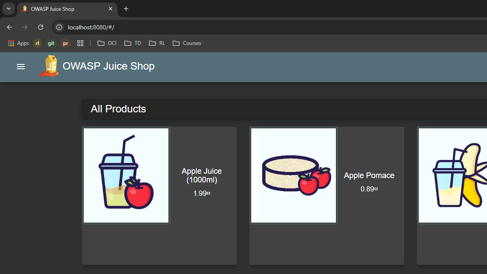

# App Deployment on KinD Cluster
## Pre-Requisite for Windows setup:
1- Kubectl utility Installed 
```
curl.exe -LO "https://dl.k8s.io/release/v1.32.0/bin/windows/amd64/kubectl.exe"
```
2- Kind command Installed
``` bash
curl.exe -Lo kind-windows-amd64.exe https://kind.sigs.k8s.io/dl/v0.26.0/kind-windows-amd64
Move-Item .\kind-windows-amd64.exe c:\some-dir-in-your-PATH\kind.exe
```

## Prepare Kubernetes Manifests for the required resources:
1- Find the suitible nginx ingress controller version for the setup
- For KinD cluster https://kind.sigs.k8s.io/examples/ingress/deploy-ingress-nginx.yaml

2- If the cluster is multiple node you must ensure that your ingress-controller is deployed on the same node where you have configured the PortMapping in the kind_cluster_config.yaml
- In our case node selector is added in line 507 to make sure it's created on the worker node
```
nodeSelector:
  kubernetes.io/hostname: "kind-worker"
```
3- Upon applying all the K8s Manifests using 
```
cd '2-Kubernetes
kubectl apply -f .
```

The application will be accessible on localhost:8080



Refrences:

https://kubernetes.io/docs/tasks/tools/

https://kind.sigs.k8s.io/docs/user/ingress/

https://kind.sigs.k8s.io/docs/user/quick-start/